## Tableau des matieres :
1. [Introduction](#introduction)
2. [Vue d’ensemble de l’implémentation](#vue-densemble-de-limplementation)
3. [Choix techniques et optimisations](#choix-techniques-et-optimisations)
4. [Tests et validation](#tests-et-validation)
5. [Module FNC](#module-fnc)
6. [Application concrète "Validation de Sodoku"](#application-concrète-validation-de-sodoku)
7. [Conclusion](#conclusion)
8. [Annexes](#annexes)

---

## **Introduction**

Ce document présente l'implémentation d'un solveur SAT basé sur le principe de résolution, ainsi que ses applications. Le projet est structuré en plusieurs modules pour assurer la clarté, la maintenance et l'extensibilité.

---

## **Vue d'ensemble de l’implémentation**
Le programme est divisé en plusieurs modules principaux :
- **Module FNC** : Permet de convertir une formule en Forme Normale Conjonctive (FNC).
- **Module de résolution** : Permet de résoudre un ensemble de clauses en utilisant la méthode de résolution.
- **Module de validation de Sodoku** : Utilise le module précédent pour valider une grille de Sudoku.

Pour codifier les formules, on a utilisé la notation suivante :
- `#xxx` pour une variable propositionnelle, où `xxx` est un entier. Exemple : `A1`, `P43`.
- `-#xxx` pour la négation d'une variable propositionnelle. Exemple : `-A1`, `-P43`.
- `(A1 | P43)` pour une disjonction.
- `(A1 & P43)` pour une conjonction.
- `(A1 > P43)` pour une implication.
- `(A1 = P43)` pour une équivalence.

Une clause est donc une disjonction de littéraux. Exemple : `A1 | P43 | -A1`.

#### Module de résolution (module principal) :

Le module prend en entrée un fichier texte contenant des clauses en FNC, les lit et crée une liste de clauses initiales.
Ensuite, il applique l'algorithme de résolution : il prend une clause et la résout avec les autres clauses de la liste pour générer de nouvelles clauses (résolvantes). Si une résolvante n'est pas déjà présente dans la liste, elle y est ajoutée.
- Si une **clause vide** est générée, l'ensemble de clauses est prouvé **inconsistant**.
- Si aucune nouvelle clause ne peut être générée, l'ensemble est prouvé **consistant**.

---

## **Choix techniques et optimisations**

Pour améliorer les performances du solveur, nous avons mis en place plusieurs optimisations techniques et logiques visant à réduire le nombre de clauses à traiter et à accélérer la résolution.

### Optimisation de la programmation :

1.  **Hachage des variables propositionnelles** :
    * À la lecture des clauses, une table de hachage associe chaque variable propositionnelle à un entier unique. Cela permet de représenter les clauses par des tableaux d'entiers, accélérant ainsi les comparaisons. Les littéraux sont stockés comme des entiers positifs ou négatifs.
    * La comparaison entre deux littéraux devient une simple comparaison d'entiers de complexité $O(1)$. La recherche de la variable correspondante est également en $O(1)$.
    * Cette méthode permet de gérer jusqu'à $2^{63}-1$ variables, ce qui est amplement suffisant.
    > Exemple : `P24` est stocké comme `1`, `-P24` comme `-1`, `Q` comme `2`.
    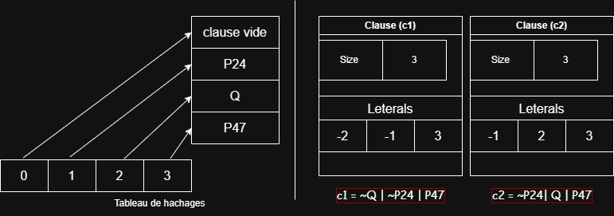

2.  **Ordonnancement des littéraux dans les clauses** :
    * Les littéraux dans chaque clause sont stockés dans un ordre croissant. Cela accélère l'opération de résolution en optimisant la recherche de littéraux complémentaires.
    * La comparaison de deux clauses est ainsi réduite à une comparaison de listes ordonnées, avec une complexité en $O(n)$, où $n$ est le nombre de littéraux.

3.  **Association d'un arbre AVL à la liste des clauses** :
    * Nous utilisons un arbre AVL pour stocker les clauses. Cela garantit que chaque clause est unique et permet de vérifier rapidement son existence avec une complexité de recherche en $O(\log n)$.
    * Une relation d'ordre sur les clauses a été définie pour permettre leur insertion dans l'arbre AVL, basée sur la comparaison lexicographique de leurs tableaux de littéraux.
    > Exemple : `[-3, -2, 1] < [-3, -1]`

### Optimisation de la logique :

1.  **Élimination des clauses redondantes** :
    * Lors de l'ajout de clauses (initiales ou résolvantes), nous vérifions si elles existent déjà grâce à l'arbre AVL pour éviter les duplicatas.

2.  **Élimination des tautologies** :
    * Toute clause contenant un littéral et sa négation (ex: `A | -A`) est une tautologie et est immédiatement écartée, car elle n'apporte aucune contrainte.

3.  **Résolution unique entre paires de clauses** :
    * La résolution étant commutative, nous nous assurons de ne la réaliser qu'une seule fois pour chaque paire de clauses, réduisant ainsi le nombre d'opérations inutiles.

---

## **Tests et validation**
Le solveur a été validé à l'aide de tests unitaires et de cas d'utilisation concrets pour vérifier son bon fonctionnement et l'efficacité des optimisations.

1.  **Lecture et résolution d'un ensemble de clauses**
    Le programme lit un fichier `clauses.txt` et détermine si l'ensemble est consistant ou inconsistant.

    * Exemple d'un **ensemble inconsistant** :
        ```plaintext
        #ensemble de clauses inconsistantes extraites du CI LOGM 2023/2024
        -P|-Q|R
        -P|-Q|S
        Q|R
        Q|S
        -Q|-S|-R
        P|R
        S|-R
        Q|-R
        ```
        > **Sortie du programme :**
        > 

    * Exemple d'un **ensemble consistant** :
        ```plaintext
        #ensemble de clauses consistantes extraites du CI LOGM 2021/2022
        -P|-Q
        -S|R
        -P|-S
        Q|S
        P|S
        -P
        ```
        > **Sortie du programme :**
        > 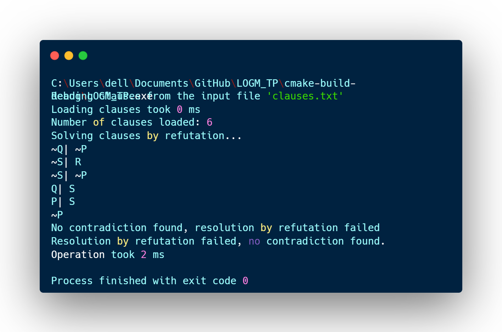

* **Fichiers de sortie** :
    * `clauses.csv` : contient les clauses générées.
    * `deduction.tex` : contient les étapes de la déduction au format LaTeX, visualisable sur notre [visionneuse TeX en ligne](https://guembo.github.io/tex_viewer/).
    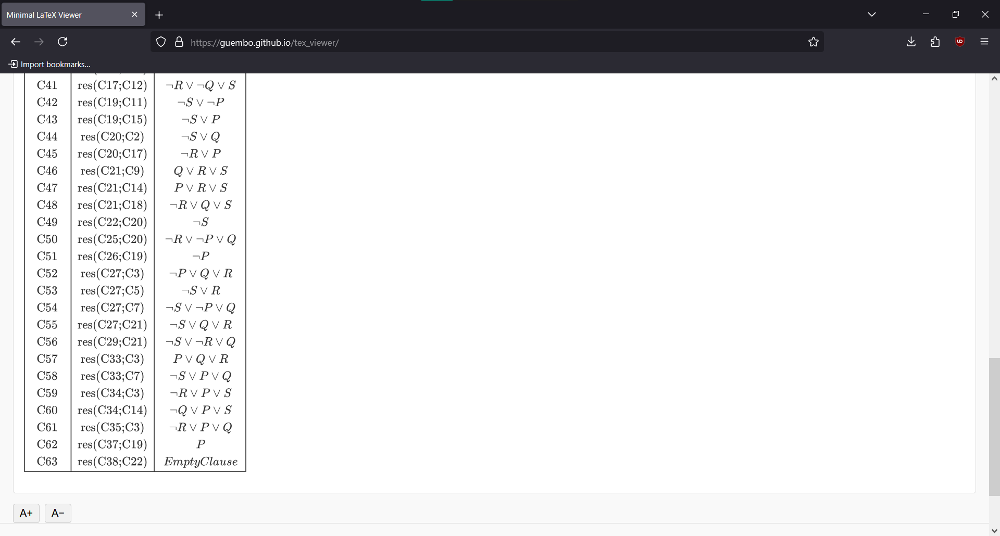

---

## **Module FNC**
Ce module est responsable de la conversion d'une formule logique arbitraire en Forme Normale Conjonctive (FNC).

### Formula-Tree :
Le module utilise une structure d'arbre binaire, la **formula-tree**, où les nœuds internes sont des opérateurs logiques (`&`, `|`, `>`, `=`) et les feuilles sont des littéraux. Cette structure permet de manipuler et de transformer la formule de manière récursive. Elle permet également de générer la table de vérité de la formule.

### Fonctionnalités du module FNC :
Le passage en FNC se fait en plusieurs étapes, chacune implémentée par une fonction :
1.  `formula_tree_remove_equivalence` : Élimine les équivalences $(A=B) \rightarrow (A>B) \& (B>A)$.
2.  `formula_tree_remove_implication` : Élimine les implications $(A>B) \rightarrow (\neg A | B)$.
3.  `formula_tree_push_negation` : Pousse les négations vers les feuilles en utilisant les lois de De Morgan.
4.  `formula_tree_distribute_disjunction` : Distribue les disjonctions sur les conjonctions pour obtenir la FNC.
5.  `formula_to_fnc` : Orchestre les étapes précédentes pour convertir la formule en une liste de clauses.

### Exemple d'utilisation du module FNC :
Pour une formule `P & (Q | R) > (S = T)` dans `formula.txt` :

1.  **Création de la formula-tree :**
    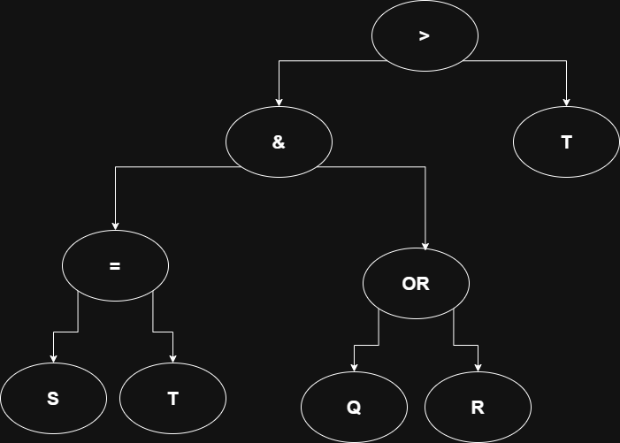
2.  **Élimination des équivalences :**
    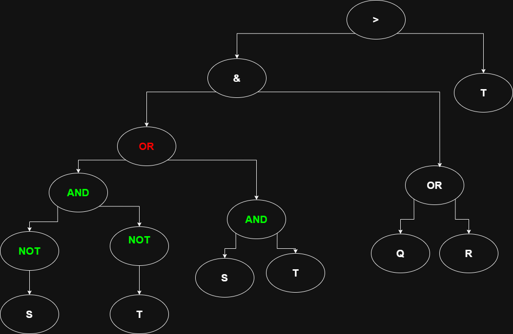
3.  **Élimination des implications :**
    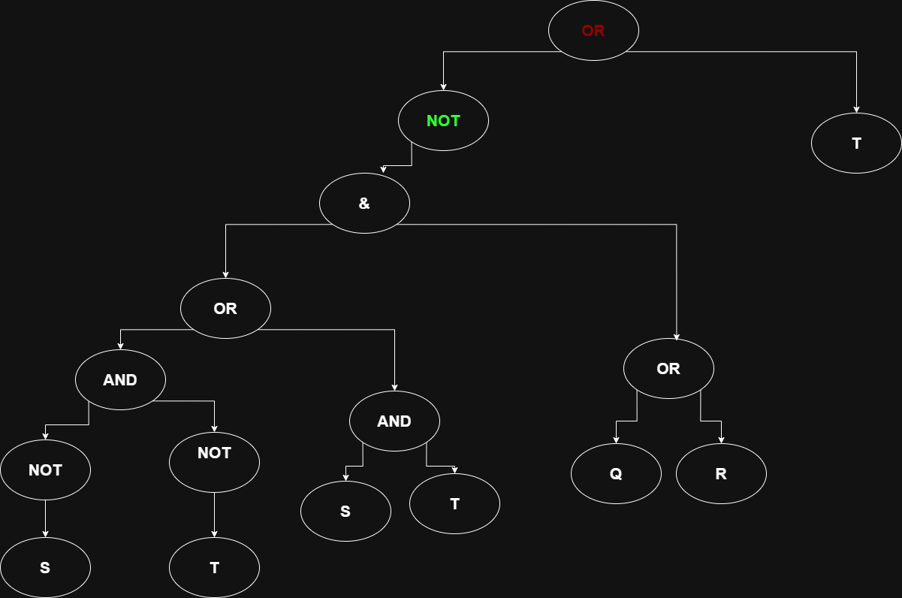
4.  **Descente des négations :**
    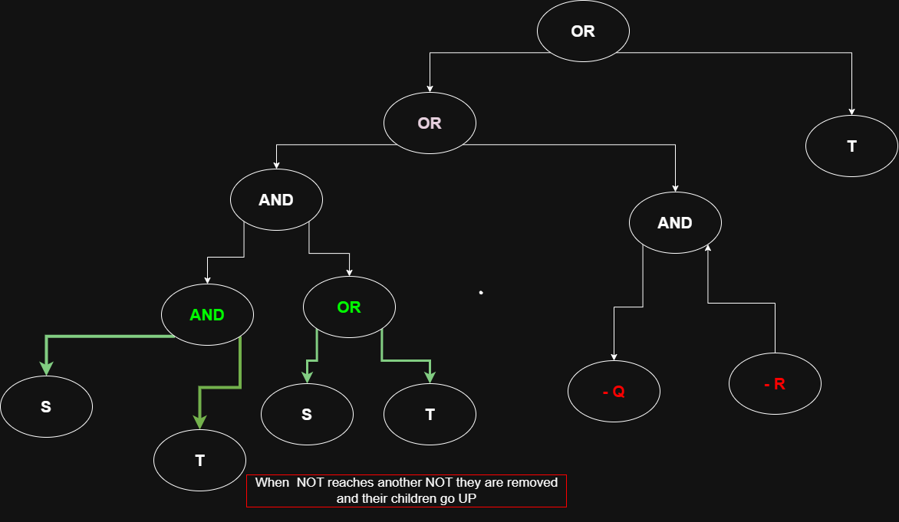
5.  **Distribution** et génération des clauses en FNC.
6.  **Résultat final** (liste de clauses) :
    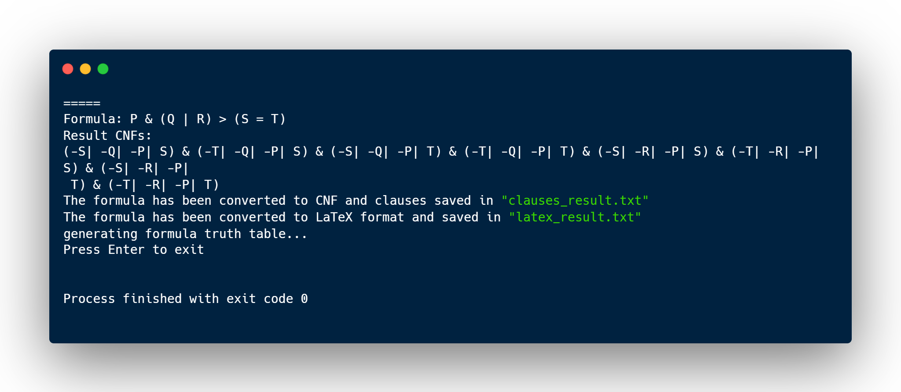

Le programme génère également les fichiers `clauses_result.txt`, `clauses_result.tex`, `truth_table.csv` et `truth_table.tex`.

---

## **Application concrète "Validation de Sudoku"**

Nous démontrons l'utilité du solveur en l'appliquant à la validation de grilles de Sudoku. Le problème est transformé en un problème de satisfiabilité.

### Encodage des règles du Sudoku en FNC
- **Variables** : Une variable propositionnelle `Xijk` est vraie si la cellule à la ligne `i` et colonne `j` contient le chiffre `k`. Cela donne $9 \times 9 \times 9 = 729$ variables.
- **Clauses** : Les règles du Sudoku sont encodées comme suit :
    1.  **Chaque cellule contient au moins un chiffre** : Pour chaque cellule $(i, j)$, on ajoute la clause $(X_{ij1} | X_{ij2} | \dots | X_{ij9})$.
    2.  **Chaque cellule contient au plus un chiffre** : Pour chaque cellule $(i, j)$ et chaque paire de chiffres $k_1 \neq k_2$, on ajoute la clause $(\neg X_{ijk_1} | \neg X_{ijk_2})$.
    3.  **Règles sur les lignes, colonnes et carrés** : Des clauses similaires sont générées pour assurer que chaque chiffre apparaît exactement une fois par ligne, par colonne et par carré de 3x3.
    4.  **Cellules pré-remplies** : Les chiffres déjà présents dans la grille sont ajoutés comme des clauses unitaires. Par exemple, si la cellule (1,1) contient 5, on ajoute la clause $(X_{115})$.

Au total, une grille de Sudoku 9x9 vide génère **11 988 clauses**.

### Résolution du Sudoku
Le programme lit une grille depuis `sodoku.txt`, la convertit en un ensemble de clauses FNC et lance le solveur.
- Si l'ensemble est **consistant**, la grille de Sudoku est **valide**.
- Si l'ensemble est **inconsistant**, la grille est **invalide**.

* **Exemple de Sudoku invalide** :
    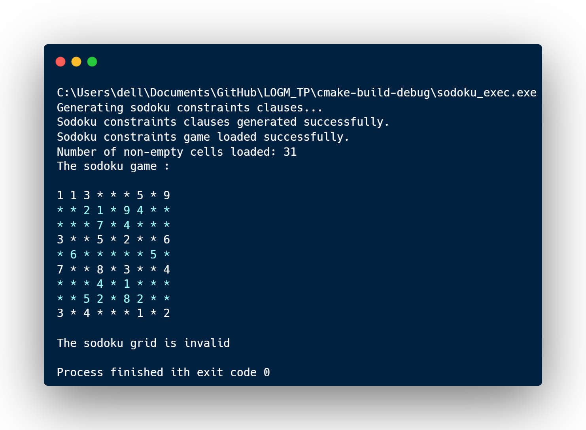

    La déduction montre la contradiction, par exemple, que la cellule (1,2) doit contenir un 3 et ne doit pas contenir un 3.

* **Exemple de Sudoku valide** :
    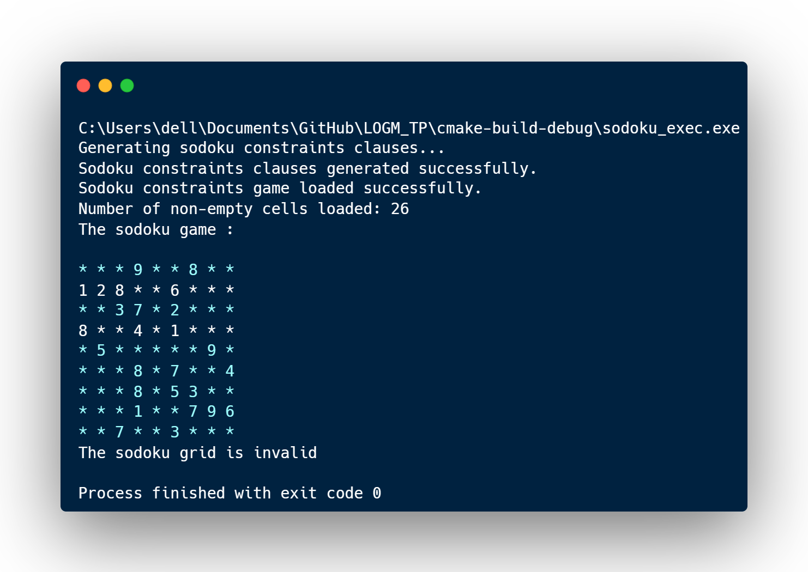

---

## **Conclusion**

Ce projet a permis de développer un solveur SAT complet et performant, basé sur l'algorithme de résolution. Grâce à une architecture modulaire bien pensée, nous avons pu séparer la logique de résolution principale des applications spécifiques. L'implémentation a été renforcée par des optimisations techniques significatives, telles que le hachage des variables, le tri des littéraux au sein des clauses et l'utilisation d'un arbre AVL pour une gestion efficace des clauses générées, prévenant ainsi les redondances et accélérant la recherche.

Le module de conversion en FNC (Forme Normale Conjonctive) démontre la capacité du projet à traiter des formules logiques complexes en les transformant en un format adéquat pour le solveur. L'application concrète de validation de Sudoku illustre parfaitement la puissance et la flexibilité du solveur SAT. En modélisant les règles du Sudoku comme un ensemble de contraintes logiques, nous avons montré comment un problème issu du monde réel peut être ramené à un problème de satisfiabilité propositionnelle et résolu de manière systématique.

En somme, ce projet constitue une exploration pratique et approfondie des concepts de la logique propositionnelle, de la conception d'algorithmes et de l'optimisation des performances, aboutissant à un outil robuste et polyvalent.

---

## **Annexes**

**Snippet 1:** Structure de nœud AVL (de `clauses_avl.h`)
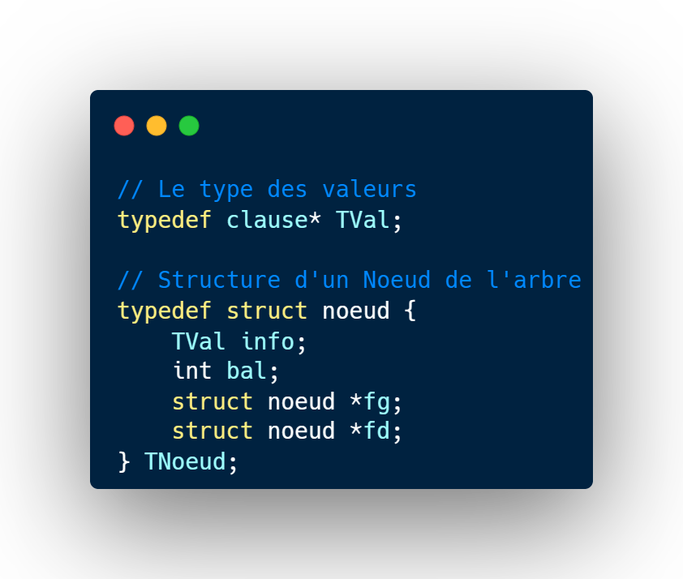

**Snippet 2:** Comparaison de clauses pour l'arbre AVL (de `clauses_avl.c`)
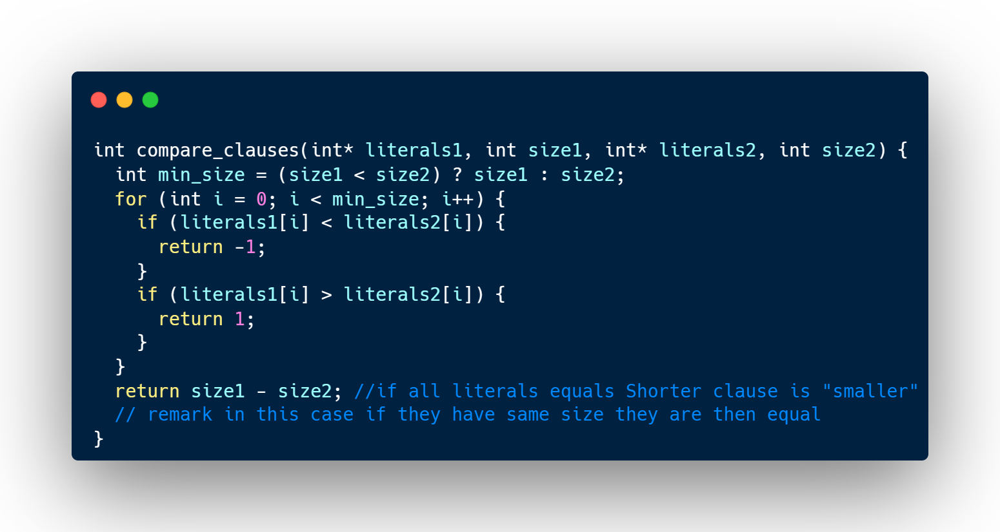

**Snippet 3:** Logique de résolution (conceptuelle, basée sur `resolution.c`)
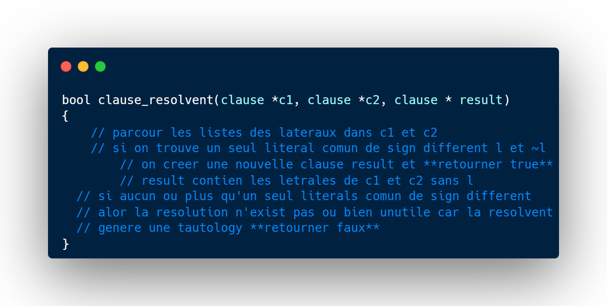

** Website pour visualiser les formules en LaTeX :**<br>
[https://guembo.github.io/tex_viewer/](https://guembo.github.io/tex_viewer/)


**Pour Le test du program**:<br>
On a dans le dossier `bin` trois dossiers :
- `cnf` : contient l'executable du module FNC, avec un fichier `formula.txt` contient une formule de test. pour tester le module FNC.
- `resolution` : contient l'executable du module de resolution, avec un fichier `clauses.txt` contient un ensemble de clauses de test. pour tester le module de resolution.
- `sodoku` : contient l'executable du module de validation de Sodoku, avec un fichier `sodoku.txt` contient un Sodoku de test. pour tester le module de validation de Sodoku.
 ** Pour faire le test vous pouvez lancer l'executable directemement ou modifier les formules et les clauses**
