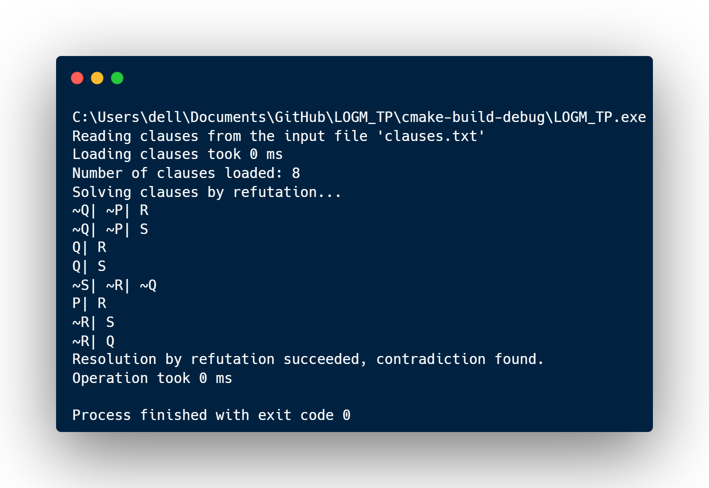
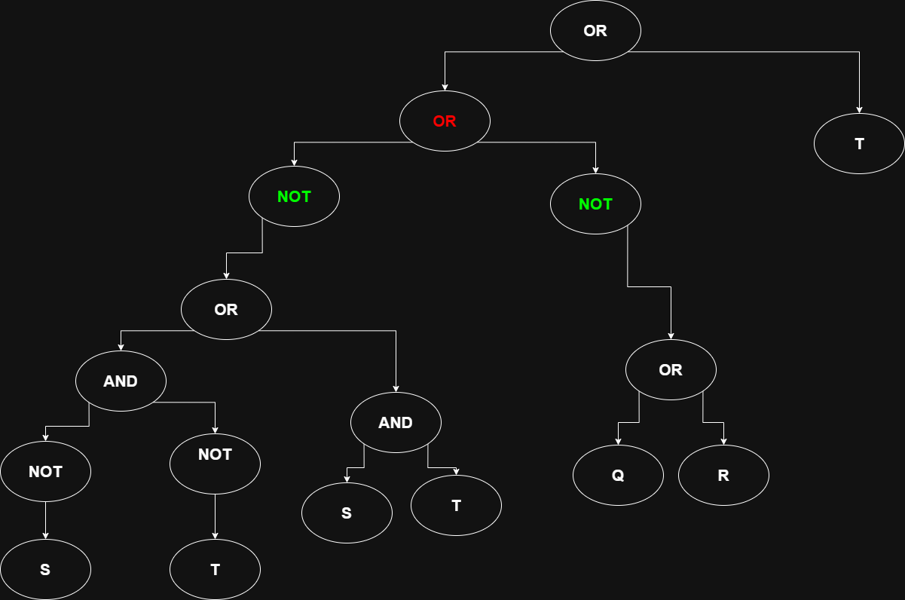
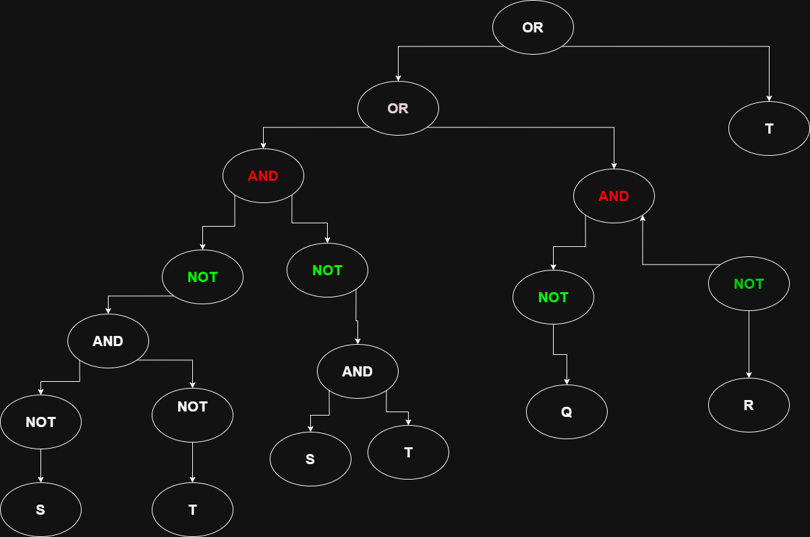
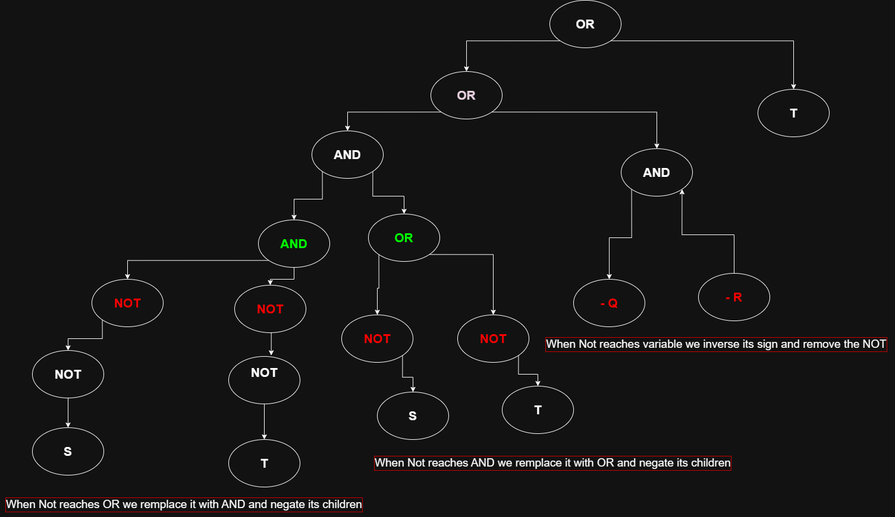
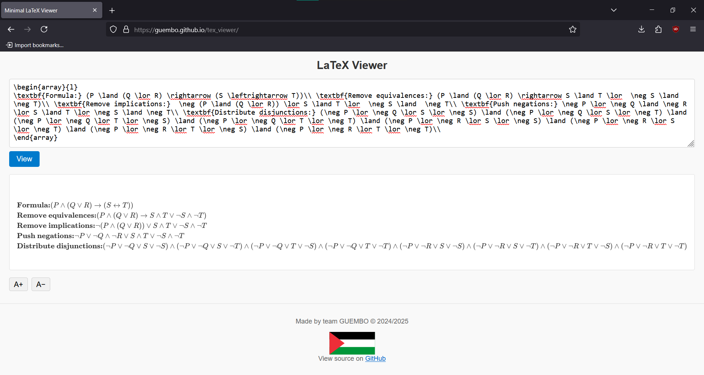
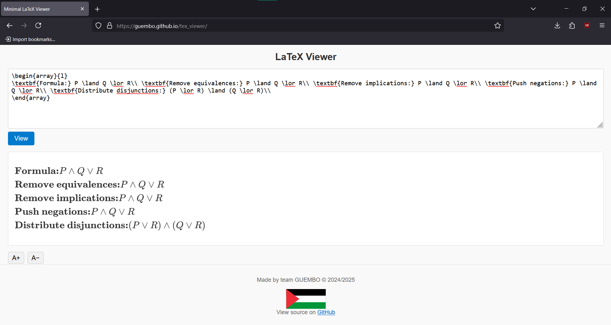

# TP LOGM 2023/2024 :
Realise par : <br>
- Beluesmia Oussama G9<br>
- Belloul Wassim Zineddine G9<br>
- Bouhoum Adlene G9<br>
- Bouhoum Anes G9<br>

---

## Tableau des matieres :
1. [Introduction](#introduction)
2. [Vue d’ensemble de l’implémentation](#vue-densemble-de-limplementation)
3. [Choix techniques et optimisations](#Choix-techniques-et-optimisations)
4. [Tests et validation](#tests-et-validation)
5. [Module FNC](#module-fnc)
6. [Application concrète "Validation de Sodoku"](#application-concrète-validation-de-sodoku)
7. [Conclusion](#conclusion)
8. [Annexes ](#annexes)


## **Introduction**

## **Vue d'ensemble de l’implémentation**
Le program est divisé en plusieurs modules principaux :
- **Module FNC** : Permet de convertir une formule en forme normale conjonctive (FNC).
- **Module de résolution** : Permet de résoudre un ensemble de clauses en utilisant la méthode de résolution.
- **Module de validation de Sodoku** : Utilise le module précédent pour valider un Sodoku.

Pour codifer les formules on a utilise la notation suivante :
- `#xxx` pour une variable propositionnelle. telle que # est une variable propositionnelle chaque `xxx` est un entier. exemple : `A1` , `P43`..
- `-#xxx` pour la négation d'une variable propositionnelle. exemple : `-A1`, `-P43`..
- `(A1 | P43)` pour une disjonction de deux variables propositionnelles. exemple : `(A1 | P43)`, `(P43 | -A1)`..
- `(A1 & P43)` pour une conjonction de deux variables propositionnelles. exemple : `(A1 & P43)`, `(P43 & -A1)`..
- `(A1 > P43)` pour une implication de deux variables propositionnelles. exemple : `(A1 > P43)`, `(P43 > -A1)`..
- `(A1 = P43)` pour une équivalence de deux variables propositionnelles. exemple : `(A1 = P43)`, `(P43 = -A1)`..

donc une clause est une liste de disjonction de variables propositionnelles. exemple : `A1 | P43 | P43 | -A1`.

#### Module de résolution (module principal) :

Prend un fichier text contenant des clauses en FNC et lit les clauses et crier une liste de clauses initiales.
Ensuite, on prend la premiere clause et génère toutes les clauses résolues possibles à partir de cette clause est tout les clauses apres elle dans la list. et c'est la clause resolvente est une nouvelle clause qui n'est pas deja dans la liste on l'ajoute à la liste des clauses .
Si on trouve une clause vide, on a prouvé que l'ensemble des clauses est inconsistant.
Si non si on ne peut pas ajouter de nouvelles clauses, on a prouvé que l'ensemble des clauses est consistant.

## **Choix techniques et optimisations**

Pour améliorer les performances du solveur on a mis en place plusieurs optimisations techniques et logiques. Ces optimisations sont basées sur des techniques de programmation efficaces et des stratégies logiques pour réduire le nombre de clauses à traiter et accélérer la résolution.
Les choix techniques et optimisations suivants ont été mis en place pour améliorer les performances du solveur :

### Optimisation de coter programmation :

1. **Hashage des variables propositionnelles** :
   * Quand on lit les clauses, on utilise un tableau de hachage pour associer à chaque variable propositionnelle un entier unique. Cela permet de réduire la taille des clauses qui sont representer par leur tail et un tableau d'entier pour les latéraux, et d'accélérer les opérations de comparaison. et dana les clauses les leterals sont stockés sous forme d'entiers positif ou négatif celon si la variable est négative ou positive.
   * D'ou l'operation de comparaison entre deux lateral est réduite à une simple comparaison d'entiers de complexité O(1) quelle que soit la taille des latéraux, Et meme pour recuperer la variable propositionnelle associée à un entier, on utilise le tableau de hachage pour retrouver rapidement la variable correspondante avec une complexité O(1) peu importe le nombre de variables propositionnelles.
   * Cette method permet de codifier jusqu'à 2^63-1 variables propositionnelles, ce qui est largement suffisant pour la plupart des applications pratiques.<br>
   >exmple : `P24` est stocké comme `1`, `-P24` est stocké comme `-1`, `Q` est stocke comme `2`, `P47` est stocké comme `3`.<br>
pour afficher les clauses ou les sauvegarder les resultats on utilise un tableau de hachage pou associer chaque entier a sa variable propositionnelle.<br>
   

2. **Ordonnement des leterals dans les clauses** : <br>
   * On stocke les lateral dans des clauses dans un ordre croissant. Cela permet d'accélérer les opérations de resolution en réduisant le nombre de comparaisons nécessaires pour trouver les leterals communs entre deux clauses.<br>
   Par exemple, si on a deux clauses `(A1 | P43 | -C)` et `(P43 | -A1)`, on les stocke sous forme de listes ordonnées `[-3, 1, 2]` et `[-1, 2]` respectivement. Cela permet de comparer les clauses plus rapidement.<br>
   * Donc la comparaison de deux clauses est réduite à une simple comparaison de listes ordonnées, avec une complexité O(n) pour comparer, avec n le nombre de leterals dans la clause la plus longue.<br>

3. **Associe une arbe AVL a la liste des clauses** :
   * On utilise une arbe AVL pour stocker les clauses. Cela permet de chercher rapidement si une clause existe déjà dans la liste des clauses qui est tres util surtouts dans le cas d'un grand nombre de clauses, avec une complexité O(log n) pour la recherche.<br>
   * Pour cela, on a definer une relation d'ordre sur les clauses, qui est basée sur la comparaison entre les tableaux d'entiers des lateraux pour qu'on puisse utiliser l'arbre AVL.
   * Par exemple, si on a deux clauses `[-3, 1, 2]` et `[-1, 2]` la premiere clause est plus petite que la deuxieme clause car le premier element de la premiere clause est plus petit que le premier element de la deuxieme clause.<br>
   `[-3, -2, 1] < [-3, -1]`

### Optimisation de coter logique :

1. **Elimination des clauses redondantes** :
   * Lors de la lecture des clauses, on élimine les clauses redondantes qui sont déjà présentes dans la liste des clauses.
   * Meme lors de la resolution on elimine les clauses qui sont deja dans la liste des clauses on utilisant l'arbre AVL pour cela.
   * Cela permet de réduire le nombre de clauses à traiter et d'accélérer la résolution.
2. **Elimination des clauses tautology** :
    * Lors de la lecture des clauses, on élimine les clauses tautology qui sont des clauses qui contiennent une variable et sa négation.
    * Par exemple, la clause `(A1 | -A1)` est une tautology et peut être éliminée.
    * meme lors de la resolution si on trouve une clause qui est une tautology on l'élimine.
    * Cela permet de réduire le nombre de clauses à traiter et d'accélérer la résolution.
3. **Faire la resolution entre deux clauses une seule fois** :
   * Car la resollution entre deux clauses est commutative, on ne fait la résolution entre deux clauses qu'une seule fois.
   * Quand on parcourt la liste des clauses, on fait la resolution entre la clause courante et toutes les clauses qui sont avant elle dans la liste.Et on ajoute la clause resolvente à la fin de la liste des clauses.
   * Cela permet de réduire le nombre de résolutions à effectuer et d'accélérer la résolution.
---

## **Tests et validation**
Pour tester le solveur SAT, on a mis en place plusieurs tests unitaires et des tests de validation sur des cas d'utilisation concrets. Ces tests permettent de vérifier le bon fonctionnement du solveur et de valider les optimisations mises en place.

1. Lis un ensemble de clauses en FNC à partir d'un fichier texte et verifier si l'ensemble des clauses est consistant ou non.
le fichier doit contenir les clauses en FNC sous forme de liste de disjonction de variables propositionnelles.<br>Par exemple :
```plaintext
#ensemble de clauses inconsistantes extraites du CI LOGM 2023/2024
-P|-Q|R
-P|-Q|S
Q|R
Q|S
-Q|-S|-R
P|R
S|-R
Q|-R
```
> L'affichage du programme :

> 

Un autre exemple de fichier contenant un ensemble de clauses consistantes :
```plaintext
#ensemble de clauses consistantes extraites du CI LOGM 2021/2022
#-P|-Q
#-S|R
#-P|-S
#Q|S
#P|S
#-P
```
> L'affichage du programme :
> 
> 

* Le programme lit le fichier, génère les clauses et utilise le module de résolution pour vérifier si l'ensemble des clauses est consistant ou non. Si l'ensemble des clauses est consistant, le programme affiche un message indiquant que l'ensemble des clauses est consistant. Si l'ensemble des clauses est inconsistant donc on trouve une clause vide, le programme affiche un message qui indique que l'ensemble des clauses est inconsistant.
* Le programme génère également un fichier `clauses.csv` contenant les clauses générées pour l'ensemble des clauses. Ce fichier peut être utilisé pour analyser les clauses et comprendre la résolution.
* Le fichier doit etre nomer `clauses.txt` et doit etre dans le meme dossier que le programme executable.
* Le programme peut être exécuté en ligne de commande avec le fichier contenant les clauses en argument :
```bash
./resolution_solver clauses.txt
```
* Le fichier `clauses.txt` doit contenuer que  des clauses en FNC, chaque clause doit être sur une ligne séparée et les variables propositionnelles sparer par `|`. Les commentaires peuvent être ajoutés en utilisant le caractère `#` au début de la ligne.

**Le fichier `deduction.tex`** : est aussi generé par le programme, il contient les clauses générées pour l'ensemble des clauses, y compris les clauses initiales et les clauses résolues. Le fichier est au format LaTeX et peut être utilisé pour générer un document PDF contenant les clauses et les étapes de la résolution. Il peut être visualisé dans le site web qu'on a créé pour afficher les formules en LaTeX : [https://guembo.github.io/tex_viewer/](https://guembo.github.io/tex_viewer/)<br>
<br>
<br>

## **Module FNC**
Le module FNC est responsable de la conversion d'une formule en forme normale conjonctive (FNC). Il permet de lire une formule en codifiier en code presenté dans ce document et de la convertir en FNC.<br>
Le fonctionnement du module FNC est basé sur les règles de simplification des formules logiques et la conversion en FNC. Il utilise une structure de données appelée "formule-tree" pour représenter la formule et effectuer les opérations logiques nécessaires.<br>

### Tree-Formula :
Le module FNC utilise une structure de données appelée "formule-tree" pour représenter la formule. Cette structure est un arbre binaire où chaque nœud représente une opération logique (conjonction, disjonction, implication, équivalence) et les feuilles sont des variables propositionnelles. La formule-tree est utilisée pour effectuer des opérations logiques sur la formule et pour la convertir en FNC.
We define the following rules for a formula-tree:
- **Tout nœud de variable propositionnelle est une formule-tree.**
- **Tout nœud de conjonction, disjonction, implication, équivalence avec deux fils gauche et droit qui sont des formules-tree est une formule-tree.**
- **Tout nœud de négation avec un seul fils (le fils droit) qui est une formule-tree est une formule-tree.**
- **Tout autre cas n'est pas une formule-tree.**

> Comme la formule-tree nous permet de evaluer la formule pour des valeurs de vérité données, On a ajouter un module qui generes la table de vérité de la formule et le sauvegarder dans un fichier CSV et un fichier Latex pour une prresntation plus lisible.
Cette structure permet de représenter des formules logiques de manière hiérarchique et de les manipuler facilement. Le module FNC fournit des fonctions pour lire une formule à partir d'un fichier texte, créer une formule-tree à partir de cette formule, et avec la formule-tree on peut effectuer plusieurs opérations logiques, comme la conversion en FNC, la simplification de la formule, et l'evaluation de la formule (truth table).
### **Fonctionnalités du module FNC :**
- **Lecture d'une formule** : Le module lit une formule à partir d'un fichier texte et crée une "formule-tree".
- **Remove Equivalence** : La fonction `formula_tree_remove_equivalence` supprime les équivalences de la formule-tree en les remplaçant par des conjonctions et des disjonctions.
- **Remove Implication** : La fonction `formula_tree_remove_implication` supprime les implications de la formule-tree en les remplaçant par des disjonctions.
- **Push Negation** : La fonction `formula_tree_push_negation` pousse les négations vers les feuilles de l'arbre en utilisant les règles de De Morgan.
- **Distribute Disjunction** : La fonction `formula_tree_distribute_disjunction` distribue les disjonctions sur les conjonctions pour obtenir une forme normale conjonctive (FNC).
- **Convert to FNC** : La fonction `formula_to_fnc` a l'aid des fonctions précédentes, convertit la formule-tree en FNC en appliquant les règles de simplification et de distribution. Et genère une liste de clauses en FNC.

### **Exemple d'utilisation du module FNC :**
Le module FNC peut être utilisé pour lire une formule à partir d'un fichier texte, la convertir en FNC et afficher les clauses en FNC. Par exemple, si on a un fichier `formula.txt` contenant la formule suivante :
```plaintext
P & (Q | R) > (S = T)
```
**1. The formula is read from the file and a formula-tree is created.**
<br>
**2. The formula-tree is simplified by removing equivalences.**
<br>
**3. The formula-tree is simplified by removing implications.**
<br>
**4. The formula-tree is simplified by pushing negations.**
 <br>
<br>
 <br>
<br>

5. The formula-tree is distributed to obtain a FNC.** The tree becames a bit large we can not display it here but we can see the result of the conversion in the next step.
**6. The FNC is generated and displayed as a list of clauses.**
<br>

**7. L'ensemble des clauses est sauvegardé dans un fichier `clauses_result.txt` , `clauses_result.tex` , tel que le fichier `clauses_result.txt` contient les clauses en FNC sous forme de liste de disjonction de variables propositionnelles.**
```plaintext
-S| -Q| -P| S| C
-T| -Q| -P| S| C
-S| -Q| -P| T| C
-T| -Q| -P| T| C
-S| -R| -P| S| C
-T| -R| -P| S| C
-S| -R| -P| T| C
-T| -R| -P| T| C
```
Et le fichier `clauses_result.tex` contient les clauses en FNC sous forme de tableau LaTeX montre tout les etapes de simplifification. Et on peut le visualiser dans le site web qu'on a créé pour afficher les formules en LaTeX : [https://guembo.github.io/tex_viewer/](https://guembo.github.io/tex_viewer/)
<br>
Le program genere également un fichier `truth_table.csv` contenant la table de vérité de la formule, qui peut être utilisé pour analyser les valeurs de vérité de la formule. Et un fichier `truth_table.tex` contenant la table de vérité de la formule en LaTeX.

Dans ce cas le tableau de vérité est un peut long (64 lignes) donc on ne peut pas l'afficher ici mais on peut le visualiser dans le site web qu'on a créé pour afficher les formules en LaTeX : [https://guembo.github.io/tex_viewer/](https://guembo.github.io/tex_viewer/)<br>
Un exemple de la table de vérité pour une formule simple : `P & Q | R` est :
<br>
#### application-concrète-validation-de-sodoku
## **Application concrète "Validation de Sodoku":**

Le fichier sodoku_by_resolution.c fournit un cas d'utilisation convaincant pour le solveur SAT en transformant un puzzle de Sudoku en un problème de satisfiabilité pour verifier esque le puzzle est valid.

### **Encodage des règles du Sudoku en CNF**
L'idée principale est de définir un ensemble de variables propositionnelles, puis de créer des clauses qui appliquent les règles du jeu.
- **Variables:** Une variable `Xijk` est définie comme vraie si et seulement si la cellule de la ligne i et de la colonne j contient le chiffre k (où i, j, k sont compris entre {1, ..., 9}). Cela donne 9 * 9 * 9 = 729 variables.
- **Clauses:** Les règles du Sudoku sont codées comme suit:
  - **Règle de cellule:** Chaque cellule doit contenir au moins et au plus un nombre. 
    - Pour chaque cellule (i, j), une clause (Xij1 | Xij2 | ... | Xij9) est générée.
    - Pour chaque cellule (i, j) et chaque paire de chiffres k1, k2,(k1!=k2) une clause (-Xijk1 | -Xijk2) est générée pour chaque paire de chiffres k1 et k2. Cela signifie que «la cellule (i,j) ne peut pas contenir à la fois le chiffre k1 ET le chiffre k2».
  - **Règles ligne :** Chaque ligne doit contenir chaque chiffre exactement une fois.
    - Pour chaque ligne i, une clause (Xi1k | Xi2k | ... | Xi9k) est générée pour chaque chiffre k.
    - Pour chaque ligne i et chaque chiffre k et chaque paire de colonnes j1, j2 (j1!=j2), une clause (-Xijk1 | -Xijk2) est générée pour chaque paire de colonnes j1 et j2.
  - **Règles colonne :** Chaque colonne doit contenir chaque chiffre exactement une fois.
    - Pour chaque colonne j, une clause (X1jk | X2jk | ... | X9jk) est générée pour chaque chiffre k.
    - Pour chaque colonne j et chaque chiffre k et chaque paire de lignes i1, i2 (i1!=i2), une clause (-Xijk1 | -Xijk2) est générée pour chaque paire de lignes i1 et i2.
  - **Règles de carré :** Chaque carré doit contenir chaque chiffre exactement une fois.
    - Pour chaque carré contienent les cellules (i1,j1), (i2,j2),...,(i9,j9), une clause (Xi1j1k | Xi2j2k | ... | Xi9j9k) est générée pour chaque chiffre k.
    - Une clause (-Xijk1 | -Xijk2) est générée pour chaque paire de cellules dans le carré (i1,j1), (i2,j2),...,(i9,j9) et chaque paire de chiffres k1, k2 (k1!=k2).
- Règles de pré-remplissage : Les cellules déjà remplies dans le Sudoku sont codées comme des clauses unitaires.
- Exemple de clause pour une cellule remplie : Si la cellule (1, 1) contient le chiffre 5, alors la clause X115 est ajoutée.

>donc pour un sodoku de taille 9x9 on a 729 variables propositionnelles et 11988 clauses and the pre assigned cellule clauses.

### **Résolution du Sudoku**:
Le program prend un fichier text contenant le Sodoku puzzle pour valider. Le fichier doit contenir les valeurs du Sodoku sous forme de grille, où chaque cellule est soit vide (représentée par un 0, #, ou *) soit remplie avec un chiffre de 1 à 9. Par exemple :
```plaintext
465728931
837946152
149235687
731582496
284679315
596314827
658127934
923865714
372491568
```
Le programme lit le fichier, génère les clauses pour les règles du Sudoku et les clauses pour les cellules pré-remplies. Ensuite, il utilise le module de résolution pour vérifier si l'ensemble des clauses est consistant ou non.
si l'ensemble des clauses est consistant, le Sudoku est valide et le programme affiche un message indique que le sodoku est valid . Si l'ensemble des clauses est inconsistant donc on trouve une clause vide, le Sudoku est invalide et le programme affiche un message qui indique que le resultat est invalide.<br>
Le programme génère également un fichier `sodoku_clauses.csv` contenant les clauses générées pour le Sudoku, y compris les clauses pré-remplies et les clauses pour les règles du Sudoku. Ce fichier peut être utilisé pour analyser les clauses et comprendre la résolution.
> Le fichier doit etre nomer `sodoku.txt` et doit etre dans le meme dossier que le programme executable.
### **Exemple de Sodoku invalide**:
```plaintext
530070003
600195000
098000060
800060003
400803001
700020006
060000280
000419005
000080079
```
**resulat du programme :** <br>


le programme genère un fichier `sodoku_clauses.csv` contenant les clauses générées pour le Sodoku invalide avec les clauses pré-assigned lit du fichier `sodoku.txt` et les clauses générées pour les règles du Sodoku.mais on utilisant des filtre on peut afficher uniquement les clauses qui etait utiliser pour avoire la contradiction.dans ce cas on a:<br>

| Clause ID | Origin                | Literals       | Type/Comment         |
|-----------|----------------------|----------------|----------------------|
| c3245     |                      | -X193 \| -X123 | \*sodoku constraints |
| c11989    |                      | X123           | initial value        |
| c11991    |                      | X193           | initial value        |
| c12060    | res(c11989;c3245)    | -X193          | resolvent            |
| c12097    | res(c11991;c12060)   | clause vide    | resolvent            |

>ps : pour afficher les clauses utiliser pour la resolution on allon de la derniere clause vide et on remonte dans l'arbre de resolution pour afficher les clauses qui ont ete utiliser pour la resolution.

### **Exemple de Sodoku valide**:
```plaintext
113000509
002109400
000704000
300502006
060000050
700803004
000401000
005208200
304000102
```
**resulat du programme :** <br>
<br>
le programme genère un fichier `sodoku_clauses.csv` contenant les clauses générées pour le Sodoku valide avec les clauses pré-assigned lit du fichier `sodoku.txt` et les clauses générées pour les règles du Sodoku.mais le fichier est n'est pas utiliser pour la resolution car le Sodoku est valide donc on n'a pas de clause vide.<br>

## **Conclusion**:

Ce projet implémente avec succès un solveur SAT fonctionnel et optimisé, basé sur le principe de résolution. La conception modulaire sépare la logique de base de son application, et l'utilisation stratégique de structures de données et d'algorithmes efficaces (listes littérales triées et arbres AVL pour la gestion des clauses) permet au solveur de traiter des problèmes complexes comme la validation de Sudoku.
Le module Sudoku démontre la puissance expressive de la logique propositionnelle, en montrant comment des problèmes concrets de satisfaction de contraintes peuvent être modélisés et résolus à l'aide d'un moteur logique générique.

## **Annexes**:

**Snippet 1:** AVL Node Structure (from clauses_avl.h)
// Represents a clause in the AVL tree


**Snippet 2:** Clause Comparison for AVL Tree (logic from clauses_avl.c)
// Compares two clauses for ordering in the AVL tree.
// Returns:
// < 0 if clause1 < clause2
// > 0 if clause1 > clause2
//   0 if clause1 == clause2 <br>


**Snippet 3:** Resolution Logic (conceptual, based on resolution.c)
// Conceptual function to resolve two clauses


**Website pour visualiser les formules en LaTeX generate par le program:**<br>
[https://guembo.github.io/tex_viewer/](https://guembo.github.io/tex_viewer/) est un site web qui permet de visualiser des formules en LaTeX. Il peut être utilisé pour afficher les formules et tableau de vireter générées par le module FNC et les clauses générées par le module de résolution. Il suffit de copier-coller le code LaTeX dans le champ de saisie et de cliquer sur "Visualiser" pour afficher la formule.

** Pour Le test du program**:<br>
On a dans le dossier `bin` trois dossiers :
- `cnf` : contient l'executable du module FNC, avec un fichier `formula.txt` contient une formule de test. pour tester le module FNC.
- `resolution` : contient l'executable du module de resolution, avec un fichier `clauses.txt` contient un ensemble de clauses de test. pour tester le module de resolution.
- `sodoku` : contient l'executable du module de validation de Sodoku, avec un fichier `sodoku.txt` contient un Sodoku de test. pour tester le module de validation de Sodoku.
 ** Pour faire le test vous pouvez lancer l'executable directemement ou modifier les formules et les clauses**